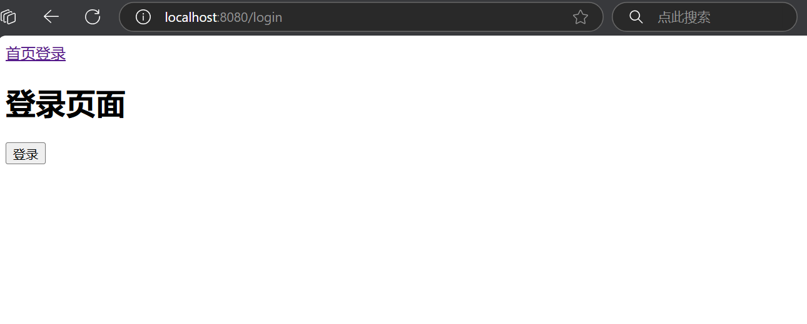
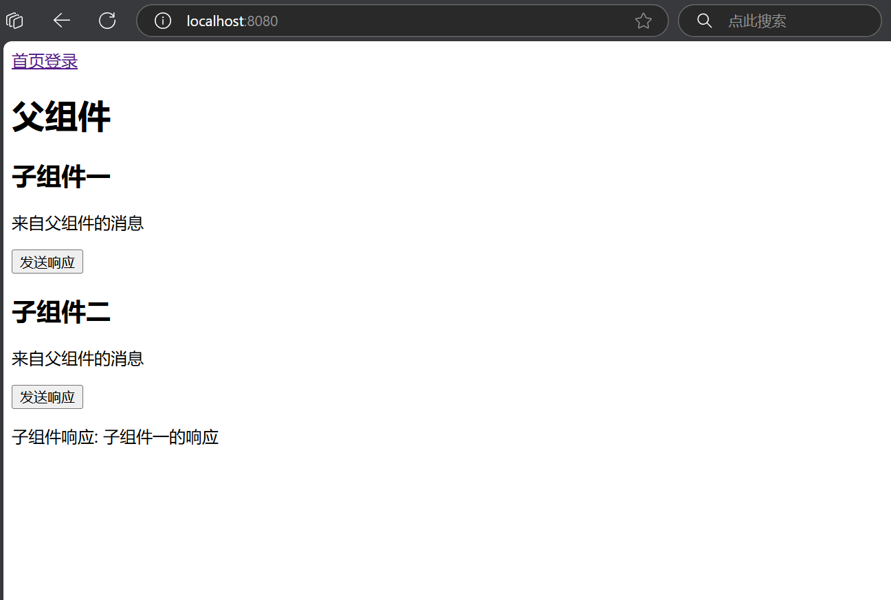
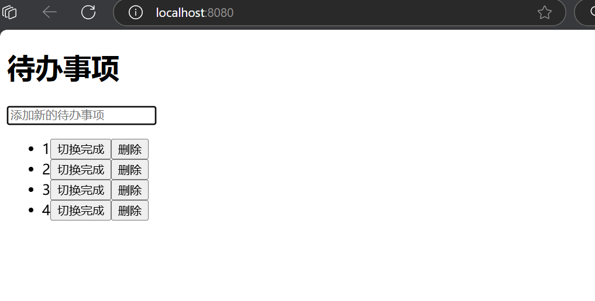

# 课后作业

### 第一次课后作业：HTML5/CSS3/JavaScript网页设计基础知识

##### 1、请结合自身所了解ES6的新特性，写出var、let和const的使用要求？

在ES6中，`var`、`let`和`const`都是用于声明变量的关键字，但它们有不同的使用要求和特性：

###### 1. `var`

- **作用域**：`var`声明的变量是函数作用域或全局作用域，如果在函数内声明则仅在该函数内有效；如果在函数外声明则是全局变量。
- **提升**：使用`var`声明的变量会被提升到函数或全局的顶部，但变量的初始化不会被提升。这意味着你可以在声明之前访问变量，但其值为`undefined`。
- **重复声明**：同一个作用域内可以重复声明同一个变量，最后的声明会覆盖之前的声明。

###### 2. `let`

- **作用域**：`let`声明的变量是块作用域，仅在其所在的代码块内有效。这使得`let`在控制结构（如`if`、`for`）中更具灵活性。
- **提升**：`let`也会被提升，但在声明之前访问会导致`ReferenceError`，即存在“暂时性死区（TDZ）”的概念。
- **重复声明**：同一作用域内不能重复声明同一个变量，否则会抛出`SyntaxError`。

###### 3. `const`

- **作用域**：`const`与`let`相同，也是块作用域。
- **提升**：与`let`一样，`const`也会被提升，但在声明之前同样不能访问。
- **不可重新赋值**：`const`声明的变量必须在声明时初始化，并且在后续的代码中不能重新赋值。如果是对象，虽然对象本身的引用不能改变，但可以修改对象的属性。
- **重复声明**：同一作用域内不能重复声明同一个变量。

##### 2、请写出在企业级项目开发过程中，前后端通信方式xml与JSON的区别与联系？

在企业级项目开发中，XML与JSON是常用的前后端通信格式，它们有以下区别与联系：

###### 区别

1. **格式与可读性**：
   - **XML**：采用标签结构，较为冗长，易于阅读和理解，但可读性较低。
   - **JSON**：采用键值对形式，更简洁，结构清晰，易于人类和机器解析。

2. **数据类型**：
   - **XML**：仅支持文本，所有数据都为字符串，需额外处理类型。
   - **JSON**：支持多种数据类型，如对象、数组、字符串、数字等，直接反映数据结构。

3. **解析与性能**：
   - **XML**：解析较慢，尤其对于大型文档，消耗更多内存。
   - **JSON**：解析速度快，轻量级，适合大多数应用场景。

4. **支持与工具**：
   - **XML**：有丰富的工具和库支持，如XPath和XSLT，适合复杂数据结构和文档。
   - **JSON**：广泛应用于JavaScript和现代Web框架，易于与RESTful API结合。

###### 联系

- **数据交换**：两者都是用于前后端数据交换的格式，能够携带复杂数据结构。
- **可扩展性**：都可以通过自定义结构来扩展，以适应特定需求。
- **跨语言**：XML与JSON都可以在不同编程语言间无缝传输数据。

##### 3、请写出在企业级项目开发过程中，HTTP Method请求方式中Get与Post的提交方式的区别与联系？ 

在企业级项目开发中，HTTP请求方式中GET与POST的区别与联系如下：

###### 区别

1. **数据传输**：
   - **GET**：通过URL传递数据，参数以查询字符串的形式附加在URL后，通常限制在2048个字符以内。
   - **POST**：通过请求体传递数据，可以发送大量数据，没有严格的长度限制。

2. **安全性**：
   - **GET**：数据在URL中可见，适合传递非敏感数据，但不安全。
   - **POST**：数据不在URL中，较为隐蔽，适合提交敏感信息，如用户登录。

3. **幂等性**：
   - **GET**：通常是安全且幂等的，重复请求不会改变服务器状态，适合获取资源。
   - **POST**：不一定是幂等的，重复请求可能会导致不同结果，适合提交数据。

4. **缓存**：
   - **GET**：可以被缓存，适合用于频繁访问的数据。
   - **POST**：一般不被缓存，适合用于提交数据的操作。

###### 联系

- **请求方式**：两者都是HTTP协议中用来与服务器交互的请求方法。
- **用途**：两者都可用于与服务器进行数据交换，GET用于获取资源，POST用于提交数据。
- **URL形式**：虽然GET通过URL传递参数，但在某些情况下（如API设计），POST也可在URL中包含信息。

##### 4、请写出在企业级项目开发过程中，C/S架构与B/S架构的优势与不足，及两者的实际应用场景？

在企业级项目开发中，C/S（客户端/服务器）架构与B/S（浏览器/服务器）架构各有其优势与不足，适用的场景也有所不同：

###### C/S架构

 优势：

1. **性能高**：客户端可以执行复杂计算，减轻服务器负担，提高响应速度。
2. **功能丰富**：可实现更丰富的用户界面和交互，支持多媒体处理。
3. **离线工作**：客户端应用可以在无网络状态下运行，具备离线功能。

 不足：

1. **维护复杂**：客户端需要定期更新，增加了维护成本。
2. **部署困难**：用户需要安装客户端软件，推广和部署较为繁琐。
3. **平台依赖性**：不同操作系统可能需要不同的客户端版本，增加了开发复杂性。

实际应用场景：

- 桌面应用程序，如财务软件、设计软件等，需高性能和复杂功能。

###### B/S架构

优势：

1. **易于维护**：更新和维护只需在服务器端进行，用户访问最新版本。
2. **跨平台**：只需浏览器即可访问，支持不同设备和操作系统。
3. **部署简便**：用户无需安装，简化了使用和推广。

 不足：

1. **性能受限**：相较于C/S，B/S在处理复杂计算时性能较低。
2. **依赖网络**：大部分功能需依赖网络，离线工作能力差。
3. **安全性问题**：数据通过网络传输，可能面临安全风险。

实际应用场景：

- Web应用，如在线办公系统、电子商务平台、内容管理系统等，需高可用性和易访问性。

### 第二次课后作业：Vue基础入门与模板语法

详情查看`test2`

### 第三次课后作业：Vue组件化开发与路由管理

详情查看`test3`

### 第四次课后作业：Vuex状态管理

详情查看`test4`

